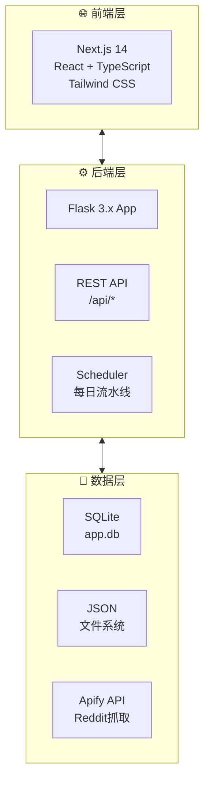

# Reddit 内容运营自动化系统

> 智能抓取 Reddit 热点、多维评分筛选、AI 内容生成与审核，构建数据驱动的社媒运营闭环。

[](https://python.org) [](https://flask.palletsprojects.com) [](LICENSE)

---

## 🎯 快速导航

| 阶段 | 名称 | 说明 |
|------|------|------|
| 主页 | 欢迎弹窗 | 首次展示系统功能和工作流程 |
| /workflow/config | P1 配置 | AI 生成关键词和搜索策略 |
| /workflow/scraping | P2 抓取 | 从 Reddit 抓取目标帖子 |
| /workflow/analysis | P3 分析 | 评分、分类、筛选候选热帖 |
| /workflow/persona | P4-1 人设 | 创建和管理账号人设 |
| /workflow/content | P4-2 创作 | AI 生成互动内容 |
| /workflow/publish | P5 发布 | 审核、发布、品牌追踪 |
| /dashboard | 仪表盘 | 全局数据概览 |
| /history | 历史记录 | 发布历史 |

---

## 📊 系统架构



---

## 🔄 核心流程

```mermaid
flowchart LR
    subgraph Input["📥 输入"]
        I1[产品信息]
        I2[关键词]
        I3[竞品]
    end

    subgraph P1["🎯 P1<br/>项目配置"]
        P1_1[AI扩展关键词]
        P1_2[AI推荐板块]
        P1_3[生成策略]
    end

    subgraph P2["🔍 P2<br/>内容抓取"]
        P2_1[APIFY抓取]
        P2_2[Mock测试]
    end

    subgraph P3["📊 P3<br/>热帖识别"]
        P3_1[计算评分]
        P3_2[自动分类]
        P3_3[筛选候选]
    end

    subgraph P4["✍️ P4<br/>内容创作"]
        P4_1[人设设计]
        P4_2[AI生成]
    end

    subgraph P5["🚀 P5<br/>发布追踪"]
        P5_1[审核工作流]
        P5_2[品牌追踪]
    end

    Input --> P1
    P1 --> P2
    P2 --> P3
    P3 --> P4
    P4 --> P5
```



---

## 📈 主要功能

| 功能 | 说明 |
|------|------|
| 智能抓取 | Apify Reddit 数据抓取，支持 Mock 测试 |
| 双评分算法 | Hot Score (0-100) + Composite Score (0-1) |
| 五维分类 | A结构型测评/B场景痛点/C观点争议/D竞品KOL/E平台趋势 |
| AI 生成 | OpenAI GPT-4o-mini + 模板回退 |
| 多账号人设 | 3种默认人设，支持自定义扩展 |
| 品牌追踪 | 自有品牌 + 竞品提及监控 |

---

## 🚀 快速开始

```bash
# 克隆仓库
git clone https://github.com/steven-95271/reddit-ops-web.git
cd reddit-ops-web

# 安装前端依赖
npm install

# 启动前端开发服务器
npm run dev
```

访问 http://localhost:3003

---

## 🌐 在线文档

- 📖 [在线文档站](https://steven-95271.github.io/reddit-ops-web/) - 包含完整流程图
- 📊 [Mermaid Live Editor](https://mermaid.live/edit#https://raw.githubusercontent.com/steven-95271/reddit-ops-web/main/docs/index.md) - 在线编辑图表

---

*最后更新：2026-04-03*
