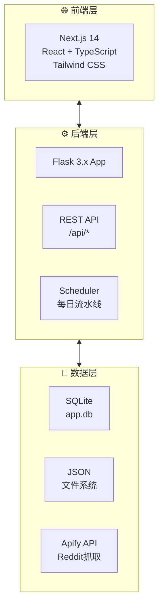

# Reddit 内容运营自动化系统

> 智能抓取 Reddit 热点、多维评分筛选、AI 内容生成与审核，构建数据驱动的社媒运营闭环。

[](https://python.org) [](https://flask.palletsprojects.com) [](https://nextjs.org) [](LICENSE)

---

## 🎯 系统概览

Reddit Ops 是一个 Reddit 内容运营自动化工具，通过 **6 步工作流** 帮你实现从数据抓取到内容发布的全流程自动化：

```
P1 配置 → P2 抓取 → P3 分析 → P4-1 人设 → P4-2 创作 → P5 发布
```

### 工作流程详解

| 阶段 | 路由 | 功能 | 说明 |
|------|------|------|------|
| **P1 配置** | `/workflow/config` | 项目配置 | AI 多轮对话生成关键词、推荐 Subreddits、搜索策略 |
| **P2 抓取** | `/workflow/scraping` | 内容抓取 | APIFY 真实抓取 / Mock 模式，支持进度监控 |
| **P3 分析** | `/workflow/analysis` | 热帖识别 | 多维评分（S/A/B/C）、5 维分类、候选筛选 |
| **P4-1 人设** | `/workflow/persona` | 人设设计 | 3 种默认人设 + 自定义，管理账号风格 |
| **P4-2 创作** | `/workflow/content` | 内容创作 | AI 扮演人设生成内容，支持审核编辑 |
| **P5 发布** | `/workflow/publish` | 发布追踪 | 审核工作流、发布队列、品牌提及追踪 |
| **仪表盘** | `/dashboard` | 数据概览 | 全局统计数据、分类分布 |
| **历史** | `/history` | 历史记录 | 发布历史、操作日志 |

---

## 📊 系统架构



---

## 🔄 核心流程

```mermaid
flowchart LR
    subgraph Input["📥 输入"]
        I1[产品信息]
        I2[关键词]
        I3[竞品]
    end

    subgraph P1["🎯 P1<br/>项目配置"]
        P1_1[AI扩展关键词]
        P1_2[AI推荐板块]
        P1_3[生成策略]
    end

    subgraph P2["🔍 P2<br/>内容抓取"]
        P2_1[APIFY抓取]
        P2_2[Mock测试]
    end

    subgraph P3["📊 P3<br/>热帖识别"]
        P3_1[计算评分]
        P3_2[自动分类]
        P3_3[筛选候选]
    end

    subgraph P4["✍️ P4<br/>内容创作"]
        P4_1[人设设计]
        P4_2[AI生成]
    end

    subgraph P5["🚀 P5<br/>发布追踪"]
        P5_1[审核工作流]
        P5_2[品牌追踪]
    end

    Input --> P1
    P1 --> P2
    P2 --> P3
    P3 --> P4
    P4 --> P5
```



---

## 📈 主要功能

| 功能 | 说明 |
|------|------|
| **智能抓取** | Apify Reddit 数据抓取，支持 Mock 测试模式 |
| **双评分算法** | Hot Score (0-100) + Composite Score (0-1) |
| **五维分类** | A 结构型测评 / B 场景痛点 / C 观点争议 / D 竞品KOL / E 平台趋势 |
| **AI 生成** | OpenAI GPT-4o-mini + 模板回退机制 |
| **多账号人设** | 3 种默认人设（运动/音频/通勤），支持自定义扩展 |
| **品牌追踪** | 自有品牌 + 竞品提及监控，情感分析 |
| **流程进度条** | 每个页面顶部显示 P1→P5 进度，清晰定位当前阶段 |

---

## 🚀 快速开始

### 前端（Next.js）

```bash
# 克隆仓库
git clone https://github.com/steven-95271/reddit-ops-web.git
cd reddit-ops-web

# 安装依赖
npm install

# 启动开发服务器
npm run dev
```

访问 http://localhost:3000

### 后端（Flask）

```bash
# 创建虚拟环境
python3 -m venv venv
source venv/bin/activate

# 安装依赖
pip install -r requirements.txt

# 启动服务
python app.py
```

---

## 📁 项目结构

```
├── app/                    # Next.js 前端
│   ├── page.tsx            # 首页（欢迎弹窗）
│   ├── layout.tsx          # 根布局
│   ├── globals.css         # 全局样式
│   ├── dashboard/          # 仪表盘
│   ├── history/            # 历史记录
│   ├── workflow/           # 工作流页面
│   │   ├── layout.tsx      # 共享布局（含流程进度条）
│   │   ├── config/         # P1 配置
│   │   ├── scraping/       # P2 抓取
│   │   ├── analysis/       # P3 分析
│   │   ├── persona/        # P4-1 人设
│   │   ├── content/        # P4-2 创作
│   │   └── publish/        # P5 发布
│   └── api/                # API 路由
├── components/             # 共享组件
│   ├── Sidebar.tsx         # 侧边导航
│   ├── BaseLayout.tsx      # 基础布局
│   └── Toast.tsx           # 提示组件
├── p1_config_generator.py  # P1 配置生成器
├── p2_scraping_manager.py  # P2 抓取管理器
├── p3_analyzer.py          # P3 分析器
├── docs/                   # 文档
└── data/                   # 数据存储
```

---

## 🌐 在线文档

- 📖 [在线文档站](https://steven-95271.github.io/reddit-ops-web/) - 包含完整流程图
- 📊 [Mermaid Live Editor](https://mermaid.live/edit#https://raw.githubusercontent.com/steven-95271/reddit-ops-web/main/docs/index.md) - 在线编辑图表

---

*最后更新：2026-04-03*
