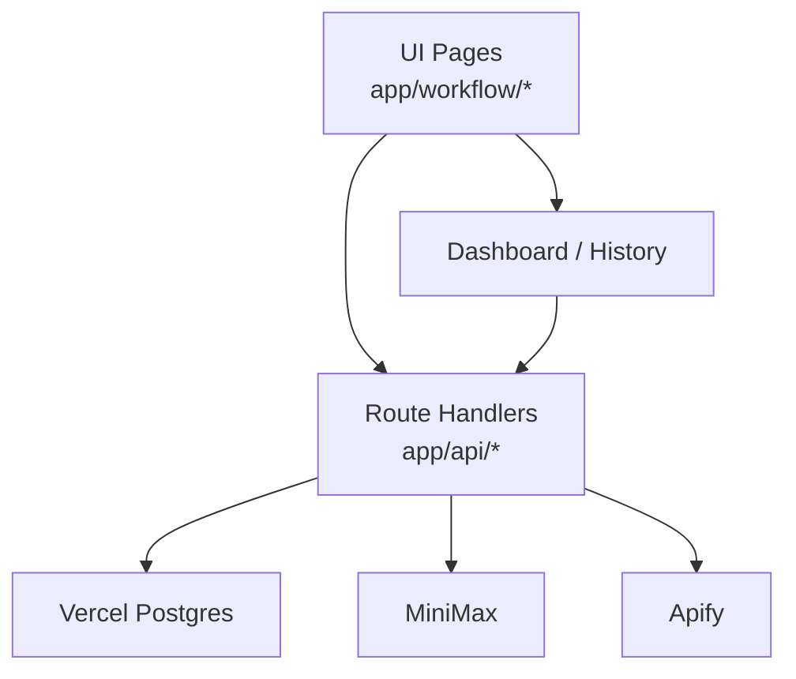

# Reddit Ops 文档索引

> 以下文档按当前仓库实现更新，默认以 `Next.js + Vercel Postgres + MiniMax + Apify` 为准。

## 快速导航

| 文档 | 说明 |
|------|------|
| [workflow/overview.md](workflow/overview.md) | 工作流总览与数据流 |
| [workflow/p1-config.md](workflow/p1-config.md) | 项目配置与 AI 扩展 |
| [workflow/p2-scraping.md](workflow/p2-scraping.md) | Apify 抓取与运行状态 |
| [workflow/p3-analysis.md](workflow/p3-analysis.md) | 帖子筛选、AI 评分、候选管理 |
| [workflow/p4-persona.md](workflow/p4-persona.md) | AI 生成人设与编辑 |
| [workflow/p4-content.md](workflow/p4-content.md) | 内容生成、质量检查、改写 |
| [workflow/p5-publish.md](workflow/p5-publish.md) | 待发布队列与发布追踪 |

## 当前架构

## 运行说明

1. `npm install`
2. 配置 `POSTGRES_URL`、`MINIMAX_API_KEY`、`MINIMAX_GROUP_ID`、`APIFY_API_TOKEN`
3. `npm run dev`
4. 首次访问 `/api/init` 初始化数据库

## 说明

- 历史文档中若仍提到 Flask、本地 JSON 存储、OpenAI fallback、多平台自动发布，请以当前代码实现为准。
- `app/api/run-pipeline/route.ts` 仍是示例接口，不代表完整自动化已打通。

最后更新：2026-04-16
