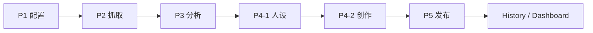
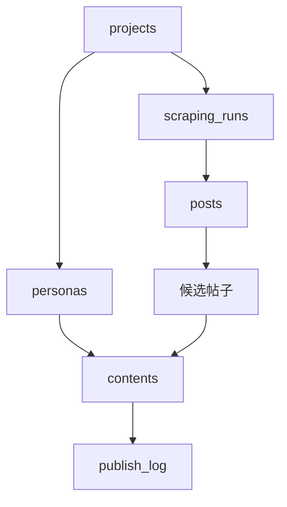

# 工作流总览

> 当前产品是一个以项目为中心的 Reddit 运营工作台，每一步都围绕 `project_id` 组织数据。

## 总体流程

## 数据流

## 各阶段职责

| 阶段 | 输入 | 输出 | 关键页面/API |
|------|------|------|--------------|
| P1 配置 | 产品描述、产品 URL、品牌、竞品、种子词 | 项目记录、phase 关键词、subreddit targets | `/workflow/config`、`/api/projects`、`/api/projects/[id]/expand`、`/api/extract-url` |
| P2 抓取 | 项目 phase 配置、Apify 参数 | `scraping_runs`、`posts` | `/workflow/scraping`、`/api/scraping/*` |
| P3 分析 | 已抓取帖子 | AI 评分、候选状态、忽略状态 | `/workflow/analysis`、`/api/posts`、`/api/posts/ai-score` |
| P4-1 人设 | 项目资料 | personas | `/workflow/persona`、`/api/personas*` |
| P4-2 创作 | 候选帖子、人设、创作模式 | contents 草稿 | `/workflow/content`、`/api/content/*` |
| P5 发布 | 已审核/待发布内容 | 发布记录、互动数据 | `/workflow/publish`、`/api/publish*` |

## 关键现状

- 当前是单体 Next.js 应用，没有独立 Flask 服务。
- 数据主存储已经切到 Postgres，不是旧文档中的 JSON 文件。
- AI 能力默认依赖 MiniMax，不再以 OpenAI 为主。
- 发布环节仍以人工发布为主，系统负责队列与追踪。

## 相关文档

- [P1 配置](p1-config.md)
- [P2 抓取](p2-scraping.md)
- [P3 分析](p3-analysis.md)
- [P4-1 人设](p4-persona.md)
- [P4-2 创作](p4-content.md)
- [P5 发布](p5-publish.md)
