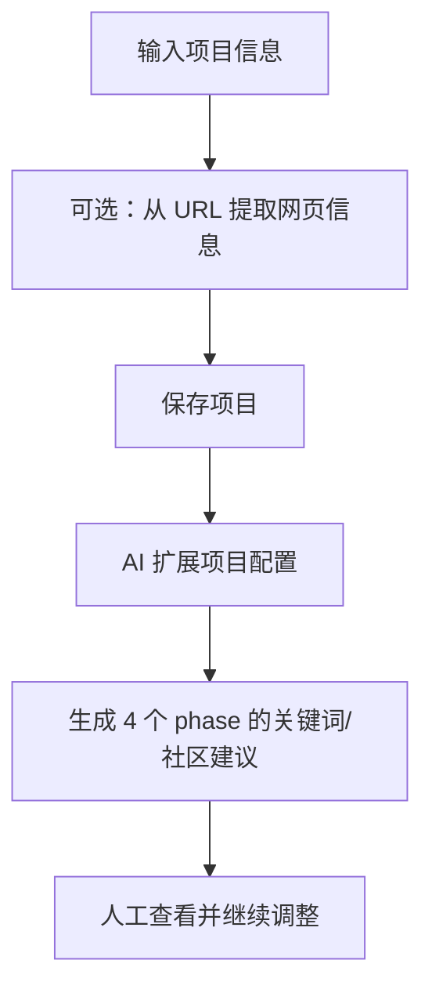

# P1 配置

> P1 负责建立项目，并把产品信息扩展成后续抓取可用的关键词与 subreddit 策略。

## 页面能力

`/workflow/config`

- 新建、编辑、删除项目
- 录入产品名、描述、目标受众、品牌、竞品、种子关键词
- 从产品 URL 抽取网页信息
- 调用 AI 扩展 phase 关键词与 subreddit targets
- 在详情弹窗中继续人工补充或修改关键词

## 当前数据结构

项目最终存入 `projects` 表，核心字段包括：

- `name`
- `product_name`
- `product_description`
- `target_audience`
- `brand_names`
- `competitor_brands`
- `keywords`
- `status`

其中 `keywords` 按当前实现主要包含：

- `seed`
- `phase1_brand`
- `phase2_competitor`
- `phase3_scene_pain`
- `phase4_subreddits`

## 实际流程

## AI 扩展结果

当前代码中，P1 扩展不是旧文档里的“三轮 UI 对话”，而是由后端生成结构化结果并回写项目。

常见输出包括：

- 品牌词搜索组
- 竞品对比词搜索组
- 场景/痛点搜索组
- subreddit 目标列表及搜索词
- Apify 可用的搜索策略片段

## 相关接口

| 接口 | 作用 |
|------|------|
| `GET /api/projects` | 获取项目列表 |
| `POST /api/projects` | 新建项目 |
| `GET /api/projects/[id]` | 获取项目详情 |
| `PUT /api/projects/[id]` | 更新项目 |
| `DELETE /api/projects/[id]` | 删除项目 |
| `POST /api/projects/[id]/expand` | 使用 MiniMax 扩展配置 |
| `POST /api/extract-url` | 从 URL 抽取网页内容并结构化 |

## 与旧文档的差异

- 不是 Flask 表单流，当前是 Next.js 页面 + API。
- 不是“确认后不可编辑”的卡片模型，项目可以继续编辑。
- 当前以 phase 配置为核心，不再强调旧版 `search_strategy` 单对象。

## 下一步

[P2 抓取](p2-scraping.md)
