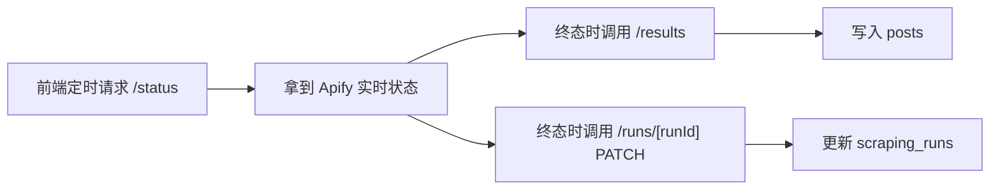

# P2 抓取

> P2 基于 P1 的 phase 配置调用 Apify Reddit Scraper，并把结果同步进 `posts`。

## 页面能力

`/workflow/scraping`

- 选择项目
- 按 4 个 phase 配置时间范围、排序方式、抓取条数
- 选择要抓取的关键词或 subreddit
- 发起 batch 抓取
- 轮询单个 run 状态
- 查看 item 数、成本、dataset id
- 成功后将结果同步写入 `posts`

## 当前实现特点
- 每个关键词或 subreddit 会形成独立 run 记录
- 运行记录写入 `scraping_runs`
- 抓取结果最终进入 `posts`
- 状态同步目前主要由前端轮询触发，不是 webhook 驱动
- `runId` 在不同接口里含义不完全一致，调用时必须区分

## 实际流程

## 抓取配置

当前 UI 和 `lib/apify.ts` 中可配置的核心参数包括：

- `time_range`: `24h | 7d | 30d | year`
- `sort_by`: `hot | new | top | relevance`
- `max_posts`
- `includeComments`
- `maxCommentsPerPost`
- `commentDepth`
- `deduplicatePosts`
- `maxRetries`

## 相关接口

| 接口 | 方法 | 当前状态 | `runId`/参数语义 | 说明 |
|------|------|----------|-------------------|------|
| `/api/scraping/single` | `POST` | 当前使用 | 无 | 为单个 query/subreddit 创建一条 `scraping_runs` 记录并启动一个 Apify run。 |
| `/api/scraping/batch` | `POST` | 当前使用 | 无 | 按 P1 phase 配置批量创建并启动多个 run，是页面“全部抓取”的主入口。 |
| `/api/scraping/custom-batch` | `POST` | 当前使用 | 无 | 只抓取用户勾选的部分 query/subreddit。 |
| `/api/scraping/batch/[id]` | `GET` | 当前使用 | `[id] = batch_id` | 查询一个 batch 下所有本地 run，并顺带向 Apify 查询运行状态；用于批量轮询。 |
| `/api/scraping/runs` | `GET` | 当前使用 | `projectId` 或 `batchId` | 读取本地 `scraping_runs` 历史记录。 |
| `/api/scraping/runs/[runId]` | `PATCH` | 当前使用 | `[runId] = apify_run_id` | 把前端轮询到的终态、dataset id、cost、item count 回写到本地 `scraping_runs`。注意这里不是本地表主键。 |
| `/api/scraping/[runId]/status` | `GET` | 当前使用 | `[runId] = apify_run_id` | 直接透传查询 Apify run 状态，前端轮询的主入口。 |
| `/api/scraping/[runId]/results` | `POST` | 当前使用 | `[runId] = apify_run_id` | 从 Apify dataset 拉取结果并写入 `posts`。真正落库发生在这里。 |
| `/api/scraping/[runId]/download` | `GET` | 当前使用，但只是下载原始 dataset | `[runId] = scraping_runs.id` | 先用本地 run 记录拿到 `apify_dataset_id`，再向 Apify 下载 CSV。不会从 `posts` 反导出。 |

| `/api/scraping` | `POST` | 兼容残留 / 基本未使用 | 无 | 旧版“一次性启动整项目抓取”的接口。直接调用 `startScraping()`，不会写 `scraping_runs`，前端页面也没有走它。可以视为遗留接口。 |
| `/api/scraping/[runId]` | `GET` | 兼容残留 / 未使用 | `[runId] = apify_run_id` | 旧版状态查询代理，返回结构和 `/status` 不同；当前页面没有调用。 |

## 相关但未打通的接口

| 接口 | 状态 | 说明 |
|------|------|------|
| `/api/apify-webhook` | 占位 / 未接入主流程 | 目前只打印 webhook 并返回成功，没有回写 `scraping_runs`，也不会自动同步 `posts`。 |

## `runId` 参数语义

当前实现里同名参数有三种不同含义：

- `batch/[id]` 里的 `id` 是本地 `batch_id`
- `runs/[runId]` 里的 `runId` 实际是 `apify_run_id`
- `[runId]/download` 里的 `runId` 是本地 `scraping_runs.id`
- `[runId]/status`、`[runId]/results`、`[runId]` 里的 `runId` 是 `apify_run_id`

这也是 P2 API 目前最容易混淆的地方。

## 产出字段

抓取后的帖子主要落在 `posts` 表：

- `reddit_id`
- `subreddit`
- `title`
- `body`
- `author`
- `url`
- `score`
- `num_comments`
- `upvote_ratio`
- `created_utc`
- `project_id`
- `scraped_at`

`posts` 表里还预留了这两个与 run 关联的字段：

- `scraping_run_id`
- `keyword`

但按当前代码实现，`/api/scraping/[runId]/results` 在插入 `posts` 时并没有写入这两个字段，也没有建立外键约束。因此现在只能确定帖子属于哪个 `project_id`，不能稳定追溯到：

- 是哪一个 `scraping_runs.id`
- 对应哪个 `apify_run_id`
- 是哪个 `query`
- 是哪个 `subreddit + keyword` 组合产生的

这是当前数据模型里的真实缺口。

## 状态同步机制

当前主链路是“前端轮询 + 前端触发回写”：

具体表现：

- `app/workflow/scraping/page.tsx` 会定时请求 `/api/scraping/[runId]/status`
- 当状态进入终态时，前端再主动调用：
  - `/api/scraping/[runId]/results`
  - `/api/scraping/runs/[runId]`
- 后端目前没有独立的后台 worker 持续更新状态
- `/api/apify-webhook` 也没有接入实际状态流转

## 当前已知限制

- `posts` 和 `scraping_runs` 没有真正写实的关联关系
- `/results` 只写 `posts`，不会回填 `inserted_posts` / `skipped_posts`
- 部分代码路径对 `/results` 的调用方法不一致，主 route 只支持 `POST`
- API 命名中的 `runId` 语义不统一，维护成本较高

## 下一步

[P3 分析](p3-analysis.md)
