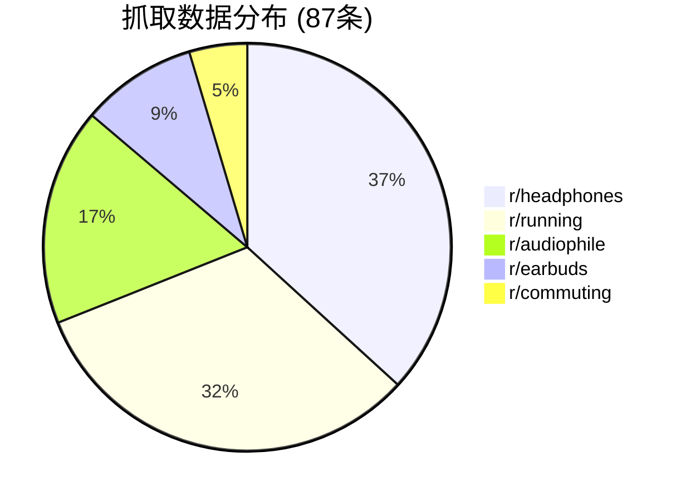
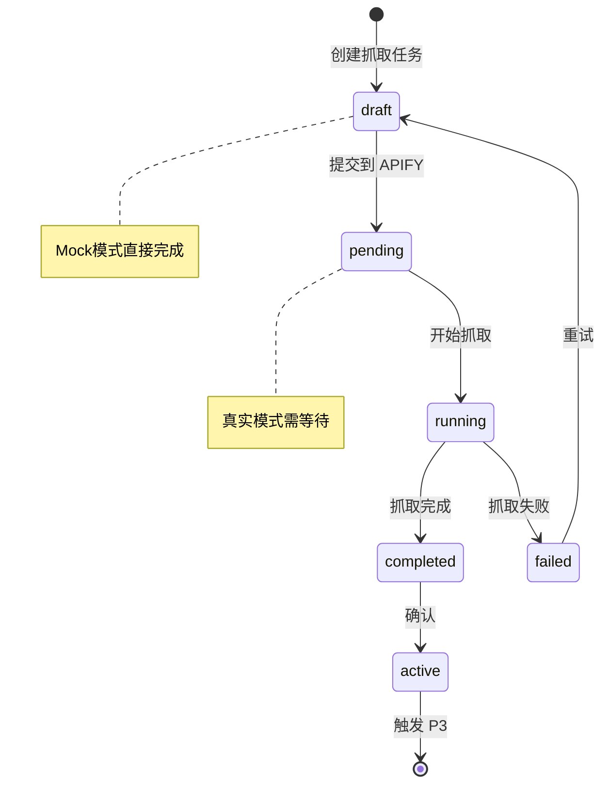

# P2 - 内容抓取

> 从 Reddit 获取真实数据，支持 Mock 测试和真实抓取双模式。

---

## 🎯 流程概览

```mermaid
flowchart TB
    subgraph INPUT["📝 输入"]
        I1[parent_card_id<br/>P1 产品卡 ID]
        I2[use_mock<br/>true/false]
    end

    subgraph STEP1["1️⃣ 加载 P1 数据"]
        S1_1[获取 P1 产品卡<br/>get_product_card]
        S1_1 --> S1_2{P1 存在?}
        S1_2 -- 否 --> S1_3[抛出异常<br/>P1 card not found]
        S1_2 -- 是 --> S1_4[提取 search_strategy]
    end

    subgraph CHOICE["⚖️ 选择运行模式"]
        C1{选择模式?}
        C1 -- 开发测试 --> MOCK["🧪 Mock模式<br/>快速验证"]
        C1 -- 正式运行 --> REAL["🌐 真实模式<br/>APIFY抓取"]
    end

    subgraph MOCK_MODE["🧪 Mock 模式（测试用）"]
        M1[生成 Mock 任务]
        M1 --> M2[模拟 87条帖子]
        M2 --> M3[包含各类场景<br/>测评/痛点/争议/竞品]
        M3 --> M4[状态：已完成<br/>立即可用]
    end

    subgraph REAL_MODE["🌐 真实 APIFY 模式"]
        R1[检查 APIFY 配置]
        R1 --> R2{配置存在?}
        R2 -- 否 --> R3[自动降级<br/>切换Mock]

        R2 -- 是 --> R4[构建搜索参数]
        R4 --> R4_1[searches: 搜索词组合]
        R4 --> R4_2[subreddits: 前5个]
        R4 --> R4_3[maxItems: 100]
        R4 --> R4_4[sort: new]

        R4_1 & R4_2 & R4_3 & R4_4 --> R5[创建 APIFY 任务]

        R5 --> R6{创建<br/>成功?}
        R6 -- 是 --> R7[返回 task_info]
        R7 --> R8[task_id: apify_xxx]
        R8 --> R9[status: pending]

        R6 -- 否 --> R11[异常处理]
        R11 --> R12[降级到 Mock]
    end

    subgraph DATA["📊 数据整理"]
        D1[原始数据] --> D2[按板块分组统计]
        D2 --> D3[r/headphones: 32条<br/>r/running: 28条<br/>r/audiophile: 15条]
        D3 --> D4[保存为 JSON 文件]
    end

    subgraph OUTPUT["✅ 输出"]
        O1[抓取卡包含<br/>✓ 原始帖子数据<br/>✓ 板块分布统计<br/>✓ 抓取日志<br/>✓ 状态：草稿]
        O2[下一步 → 点击"确认"<br/>进入热帖识别]
    end

    %% 连接
    I1 & I2 --> S1_1
    S1_4 --> CHOICE
    C1 --> MOCK
    C1 --> REAL
    MOCK --> M4
    REAL --> R1
    R9 & R12 --> DATA
    M4 --> DATA
    DATA --> D4
    D4 --> OUTPUT

    %% 样式
    classDef input fill:#e8f5e9,stroke:#2e7d32
    classDef decision fill:#fff9c4,stroke:#f57f17,stroke-width:2px
    classDef mock fill:#fce4ec,stroke:#c2185b
    classDef real fill:#e3f2fd,stroke:#1565c0
    classDef output fill:#e1f5fe,stroke:#01579b,stroke-width:3px

    class I1,I2 input
    class CHOICE,C1,R2,R6 decision
    class MOCK_MODE,M1,M2,M3,M4 mock
    class REAL_MODE,R1,R4,R4_1,R4_2,R4_3,R4_4,R5,R7,R8,R9,R11,R12 real
    class O1,O2 output
```

---

## 🔄 双模式对比

| 模式 | 用途 | 速度 | 数据真实性 |
|------|------|------|------------|
| **Mock** | 开发测试 | ⚡ 即时 | 模拟数据 |
| **真实** | 正式运行 | ⏱️ 1-2分钟 | 真实 Reddit 数据 |

### Mock 模式适用场景
- 开发和调试
- 功能测试
- 演示展示
- AI API 不可用时

### 真实模式适用场景
- 正式内容运营
- 数据分析
- 竞品监控

---

## 📡 APIFY 抓取配置

### 搜索参数

```json
{
    "searches": "open ear earbuds OR running headphones OR Shokz alternative",
    "subreddits": ["headphones", "running", "earbuds", "audiophile", "commuting"],
    "maxItems": 100,
    "sort": "new"
}
```

### 过滤规则

| 规则 | 值 | 说明 |
|------|-----|------|
| 时间范围 | 过去7天 | 抓取近期内容 |
| 最大数量 | 100条 | 单次抓取上限 |
| 最低点赞 | 5个 | 过滤低质量内容 |
| 排序方式 | newest | 最新优先 |

---

## 📊 数据统计示例

### 板块分布



### 原始数据结构

```json
{
    "posts": [
        {
            "id": "abc123",
            "title": "Just tried Oladance OWS Pro...",
            "selftext": "Been using these for a week...",
            "subreddit": "headphones",
            "upvotes": 245,
            "comments": 38,
            "created_utc": 1709312400,
            "url": "https://reddit.com/..."
        }
    ],
    "total_posts": 87,
    "scraped_at": "2024-03-01T09:00:00Z"
}
```

---

## 🔄 状态流转



---

## 💡 设计亮点

| 亮点 | 说明 |
|------|------|
| **自动降级** | APIFY 不可用时自动切换 Mock |
| **实时状态** | 支持查询任务进度 |
| **容错处理** | 异常不会中断流程 |
| **数据统计** | 自动生成抓取报告 |

---

## 🔗 相关文档

- [L1 总览](overview.md)
- [P1 - 项目配置](p1-config.md)
- [P3 - 热帖识别](p3-analysis.md)
