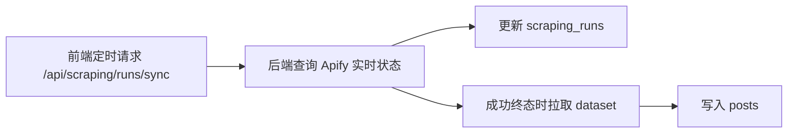

# P2 抓取

> P2 基于 P1 的 phase 配置调用 Apify Reddit Scraper，并把结果同步进 `posts`。

## 页面能力

`/workflow/scraping`

- 选择项目
- 按 4 个 phase 配置时间范围、排序方式、抓取条数
- 选择要抓取的关键词或 subreddit
- 发起 batch 抓取
- 自动轮询或手动同步任务状态
- 查看 item 数、成本、dataset id
- 成功后将结果同步写入 `posts`
- 导出当前项目全部 `posts`（`csv` / `xlsx`）

## 当前实现特点
- 每个关键词或 subreddit 会形成独立 run 记录
- 运行记录写入 `scraping_runs`
- 抓取结果最终进入 `posts`
- 状态同步目前主要由前端轮询触发，不是 webhook 驱动
- `posts` 会保留抓取来源元数据，便于回溯到 run / batch / phase

## 实际流程

## 抓取配置

当前 UI 和 `lib/apify.ts` 中可配置的核心参数包括：

- `time_range`: `24h | 7d | 30d | year`
- `sort_by`: `hot | new | top | relevance`
- `max_posts`
- `includeComments`
- `maxCommentsPerPost`
- `commentDepth`
- `deduplicatePosts`
- `maxRetries`

## 相关接口

| 接口 | 方法 | 当前状态 | `runId`/参数语义 | 说明 |
|------|------|----------|-------------------|------|
| `/api/scraping/single` | `POST` | 当前使用 | 无 | 为单个 query/subreddit 创建一条 `scraping_runs` 记录并启动一个 Apify run。 |
| `/api/scraping/batch` | `POST` | 当前使用 | 无 | 按 P1 phase 配置批量创建并启动多个 run，是页面“全部抓取”的主入口。 |
| `/api/scraping/custom-batch` | `POST` | 当前使用 | 无 | 只抓取用户勾选的部分 query/subreddit。 |
| `/api/scraping/runs` | `GET` | 当前使用 | `projectId` 或 `batchId` | 读取本地 `scraping_runs` 历史记录。 |
| `/api/scraping/runs/sync` | `POST` | 当前使用 | `projectId` 或 `batchId` 或 `runIds[]` | 统一同步入口。后端内部负责查询 Apify、回写 `scraping_runs`、并在成功终态时拉取 dataset 写入 `posts`。 |
| `/api/scraping/[runId]/download` | `GET` | 当前使用，但只是下载原始 dataset | `[runId] = scraping_runs.id` | 先用本地 run 记录拿到 `apify_dataset_id`，再向 Apify 下载 CSV。不会从 `posts` 反导出。 |
| `/api/posts/export` | `GET` | 当前使用 | `project_id` + `format=csv|xlsx` | 导出当前项目所有已入库 `posts`，包含抓取来源字段。 |

## 相关但未打通的接口

| 接口 | 状态 | 说明 |
|------|------|------|
| `/api/apify-webhook` | 占位 / 未接入主流程 | 目前只打印 webhook 并返回成功，没有回写 `scraping_runs`，也不会自动同步 `posts`。 |

## `runId` 参数语义

当前实现里只保留两种主参数语义：

- `/api/scraping/[runId]/download` 里的 `runId` 是本地 `scraping_runs.id`
- `/api/scraping/runs/sync` 优先使用 `projectId`；也支持 `batchId` 或 `runIds[]`

页面自动轮询与“同步所有任务状态”按钮现在都传 `projectId`。

## 产出字段

抓取后的帖子主要落在 `posts` 表，核心字段包括：

- `id`
- `reddit_id`
- `project_id`
- `scraping_run_id`
- `apify_run_id`
- `batch_id`
- `phase`
- `keyword`
- `subreddit`
- `title`
- `body`
- `author`
- `url`
- `reddit_url`
- `score`
- `num_comments`
- `upvotes`
- `comments`
- `created_utc`
- `created_at_reddit`
- `scraped_at`

当前实现会在同步成功终态时直接写入以下抓取来源字段：

- `scraping_run_id`
- `apify_run_id`
- `batch_id`
- `phase`
- `keyword`

因此帖子可以追溯到：

- `scraping_runs.id`
- `scraping_runs.apify_run_id`
- `scraping_runs.batch_id`
- `scraping_runs.phase`
- `query`

此外，`initDb()` 会尝试对已有历史数据做一次回填：

- 如果 `posts.scraping_run_id` 已存在，但 `apify_run_id / batch_id / phase` 为空
- 则会从 `scraping_runs` 补齐这些字段

但目前仍没有数据库外键约束，数据完整性还是靠应用层保证。

## 状态同步机制

当前主链路是“前端轮询统一同步接口 + 后端完成所有 Apify 交互与落库”：

具体表现：

- `app/workflow/scraping/page.tsx` 会定时请求 `/api/scraping/runs/sync`
- 请求体当前使用 `{ projectId }`
- 页面上“同步所有任务状态”按钮也调用同一个接口
- 页面上可以手动开关自动轮询
- 后端目前没有独立的后台 worker 持续更新状态
- `/api/apify-webhook` 也没有接入实际状态流转

后端为了降低同步接口的冲击，当前做了几层收缩：

- 只处理未终态 run，或 `succeeded` 但结果尚未落库的 run
- 对刚检查过的 run 做短时间窗口跳过
- 对 run 同步使用数据库 lease，避免并发请求重复处理同一条 run
- 限制并发数，避免单次请求同时打满 Apify 和数据库

这也是 `runs/sync` 虽然仍可能较慢，但没有继续退化成前端多接口拼装的原因。

## 当前已知限制

- 没有独立后台调度器，状态推进仍依赖前端轮询或手动同步
- `runs/sync` 是可能较慢的聚合同步接口，项目级 run 数很多时会明显变慢
- 历史上如果某些 `posts` 连 `scraping_run_id` 都没有写入，就无法自动补全其 `apify_run_id / batch_id / phase`
- `sync` 接口虽然支持 `projectId / batchId / runIds[]` 三种 selector，但页面当前统一只使用 `projectId`

## 下一步

[P3 分析](p3-analysis.md)
