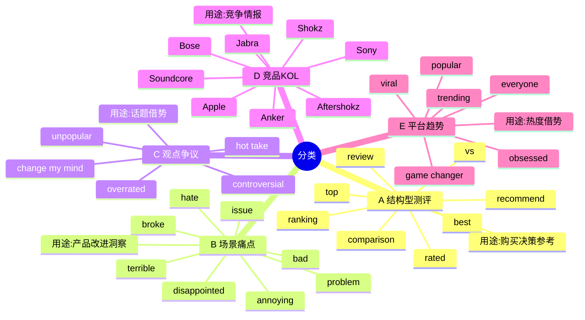
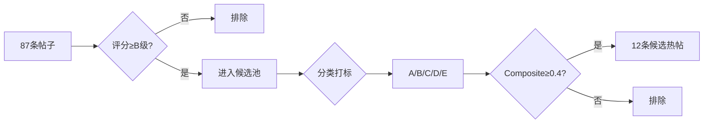

# P3 - 热帖识别

> 像"爆款雷达"一样发现高价值内容，5维评分+自动分类打标。

---

## 🎯 流程概览

```mermaid
flowchart TB
    subgraph INPUT["📝 输入"]
        I1[87条帖子<br/>P2抓取结果]
    end

    subgraph SCORING["🎯 第1步：计算热度评分"]
        S1[分析每个帖子<br/>5个维度打分]

        subgraph DIMENSIONS["5个评分维度"]
            D1[🔥 热度分 30%<br/>每100赞=1分<br/>每20评论=1分]
            D2[⏰ 时效分 25%<br/>24h内=20分<br/>48h=15分<br/>>72h=5分]
            D3[💬 互动深度 20%<br/>评论/点赞>0.3<br/>=20分]
            D4[🎯 关键词匹配 15%<br/>每匹配1词=4分]
            D5[📈 增长速率 10%<br/>>10赞/h=20分]
        end

        S1 --> D1 & D2 & D3 & D4 & D5

        D1 & D2 & D3 & D4 & D5 --> S2[Hot Score<br/>0-100分]

        S2 --> S3[划分等级]
        S3 --> S4[S级 ≥70分<br/>强烈推荐 🔴]
        S3 --> S5[A级 ≥50分<br/>优质候选 🟠]
        S3 --> S6[B级 ≥30分<br/>一般候选 🟡]
        S3 --> S7[C级 <30分<br/>暂不考虑 ⚪]
    end

    subgraph CLASSIFY["🏷️ 第2步：自动分类"]
        C1[分析帖子内容] --> C2[匹配关键词]

        C2 --> C3[A类：结构型测评 🔵<br/>review/comparison/best<br/>购买决策参考]
        C2 --> C4[B类：场景痛点 🔴<br/>problem/issue/hate<br/>产品改进洞察]
        C2 --> C5[C类：观点争议 🟡<br/>overrated/controversial<br/>话题借势]
        C2 --> C6[D类：竞品KOL 🟣<br/>Shokz/Bose/Sony<br/>竞争情报]
        C2 --> C7[E类：平台趋势 🟢<br/>trending/viral<br/>热度借势]
    end

    subgraph FILTER["✅ 第3步：筛选候选"]
        F1[筛选条件] --> F2[评分≥B级<br/>Composite≥0.4]
        F2 --> F3[从87条中<br/>选出12条候选]
    end

    subgraph OUTPUT["✅ 输出"]
        O1[识别卡包含<br/>✓ 12条候选热帖<br/>✓ 评分+分类标签<br/>✓ 统计分析报告<br/>✓ 状态：草稿]
        O2[下一步 → 点击"确认"<br/>进入人设设计]
    end

    %% 连接
    I1 --> S1
    S4 & S5 & S6 & S7 --> CLASSIFY
    CLASSIFY --> FILTER
    F3 --> OUTPUT

    %% 样式
    classDef input fill:#e8f5e9,stroke:#2e7d32
    classDef ai fill:#f3e5f5,stroke:#7b1fa2
    classDef score fill:#fff3e0,stroke:#e65100
    classDef class fill:#e1f5fe,stroke:#01579b
    classDef output fill:#e1f5fe,stroke:#01579b,stroke-width:3px

    class I1 input
    class DIMENSIONS,S1,S2,S3,D1,D2,D3,D4,D5 ai
    class S4,S5,S6,S7 score
    class C1,C2,C3,C4,C5,C6,C7 class
    class OUTPUT,O1,O2 output
```

---

## 🎯 评分算法详解

### Hot Score 计算公式

```
Hot Score = 热度分×30% + 时效分×25% + 互动深度×20% + 关键词匹配×15% + 增长速率×10%
```

### 各维度计算规则

| 维度 | 权重 | 计算规则 |
|------|------|----------|
| **热度分** | 30% | 每100 upvotes = 1分，最高10分<br/>每20 comments = 1分，最高10分 |
| **时效分** | 25% | 24h内=20分，48h=15分<br/>72h=10分，>72h=5分 |
| **互动深度** | 20% | 评论/点赞比 >0.3 = 20分<br/>>0.1 = 15分，否则10分 |
| **关键词匹配** | 15% | 每匹配1个关键词 = 4分，最高20分 |
| **增长速率** | 10% | >10赞/h=20分，>5赞/h=15分<br/>>1赞/h=10分，否则5分 |

---

## 🏷️ 五维分类系统



### 分类统计示例

| 分类 | 数量 | 颜色 | 业务价值 |
|------|------|------|----------|
| A 结构型测评 | 3条 | 🔵 蓝色 | 购买决策参考 |
| B 场景痛点 | 4条 | 🔴 红色 | 产品改进洞察 |
| C 观点争议 | 2条 | 🟡 黄色 | 话题借势 |
| D 竞品KOL | 2条 | 🟣 紫色 | 竞争情报 |
| E 平台趋势 | 1条 | 🟢 绿色 | 热度借势 |

---

## 📊 评分等级

```mermaid
gantt
    title 评分等级划分
    dateFormat X
    axisFormat %s分

    section 等级
    S级 (≥70)     :0, 70
    A级 (≥50)     :0, 50
    B级 (≥30)     :0, 30
    C级 (<30)     :0, 30
```



| 等级 | 分数范围 | 颜色 | 说明 |
|------|----------|------|------|
| **S** | ≥70 | 🔴 | 强烈推荐，综合评分优秀 |
| **A** | 50-69 | 🟠 | 优质候选，综合评分良好 |
| **B** | 30-49 | 🟡 | 一般候选，综合评分达标 |
| **C** | <30 | ⚪ | 暂不考虑，低于阈值 |

---

## 🔄 候选筛选流程



### 特殊加分规则

| 分类 | 条件 | 加分 |
|------|------|------|
| C 类（观点争议） | 评论/点赞比 >0.5 | +2分 |
| E 类（平台趋势） | 帖子点赞 ≥500 | +2分 |

---

## 📈 关键词云

```mermaid
wordcloud
    title 候选热帖关键词云
    comfor:45
    running:38
    sound:32
    earbuds:28
    battery:25
    fit:22
    music:20
    workout:18
    commute:15
    comfort:12
```

---

## 💡 设计亮点

| 亮点 | 说明 |
|------|------|
| **多维度评分** | 5个维度综合评估，避免单一指标偏差 |
| **自动分类** | 基于关键词匹配，无需人工打标 |
| **阈值可调** | 评分阈值可根据业务需求调整 |
| **实时统计** | 自动生成分类分布和关键词云 |

---

## 🔗 相关文档

- [L1 总览](overview.md)
- [P2 - 内容抓取](p2-scraping.md)
- [P4-2 - 内容创作](p4-content.md)
