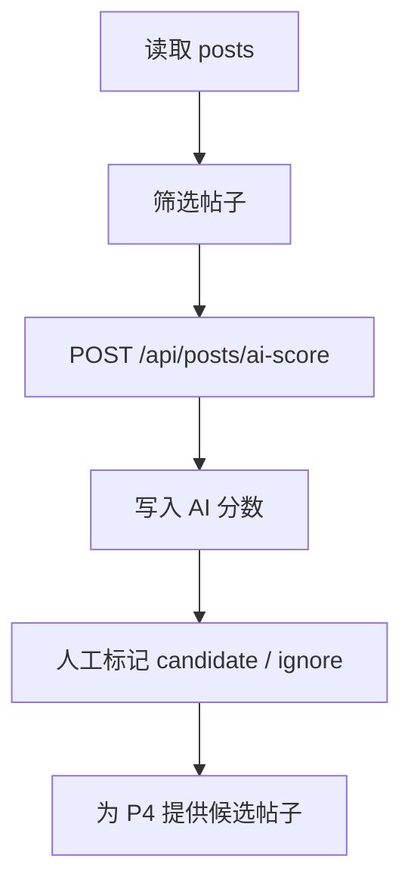

# P3 分析

> P3 用来查看抓取结果、执行 AI 评分，并把值得跟进的帖子标为候选。

## 页面能力

`/workflow/analysis`

- 按项目查看帖子
- 基于质量分、时间范围、phase、候选状态、忽略状态筛选
- 执行 AI 评分
- 标记候选 / 取消候选
- 忽略 / 取消忽略

## 当前评分模型

页面与 API 共同使用两类信息：

- 基础互动指标：`score`、`num_comments`、`upvote_ratio`、发帖时间
- AI 评分字段：`ai_relevance_score`、`ai_intent_score`、`ai_opportunity_score`

页面展示的质量分是基于这些字段计算出的综合值，不再是旧文档中固定的“五维评分设计稿”。

## 实际流程

## 页面筛选项

- `min_quality`
- `time_range`
- `phase`
- `show_candidates`
- `show_ignored`

## 相关接口

| 接口 | 作用 |
|------|------|
| `GET /api/posts` | 获取帖子列表与统计 |
| `POST /api/posts/ai-score` | 批量 AI 评分 |
| `POST /api/posts/[id]/action` | 标记候选、取消候选、忽略、取消忽略 |
| `GET /api/analysis` | 内容创作页读取候选帖子 |

## 当前产出

P3 结束后，系统至少会留下两类关键结果：

- AI 补充的机会判断分数
- 人工确认过的候选帖子集合

这些数据直接驱动 P4-2 的内容生成。

## 与旧文档的差异

- 当前更强调“AI + 人工筛选”的工作台，而不是自动打 A/B/C/D/E 五类标签的设计稿展示。
- 候选数量上限与偏好控制在页面侧实现，不是固定 87 -> 12 的流水线。

## 下一步

- [P4-1 人设](p4-persona.md)
- [P4-2 创作](p4-content.md)
