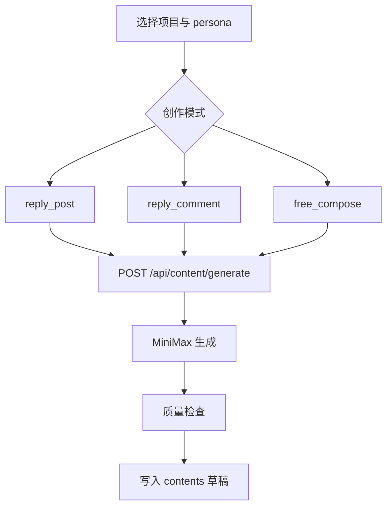

# P4-2 创作

> P4-2 使用 persona + 候选帖子或用户输入，生成更接近真实 Reddit 用户口吻的内容草稿。

## 页面能力

`/workflow/content`

- 选择项目和 persona
- 选择创作模式
- 生成内容
- 修改内容
- 重新生成
- 查看质量分与问题提示

## 当前支持的 3 种模式

| 模式 | 说明 |
|------|------|
| `reply_post` | 针对候选帖子生成回复 |
| `reply_comment` | 针对指定评论生成回复 |
| `free_compose` | 自由发帖，生成标题和正文 |

## 生成逻辑

当前后端通过 `MiniMax` 生成内容，并结合 `lib/quality-check.ts` 进行质量检查。

重点约束包括：

- 尽量避免明显 AI 腔
- 控制品牌提及频率
- 引导更像 Reddit 对话风格
- 对输出内容打质量分并列出问题

## 实际流程

## 相关接口

| 接口 | 作用 |
|------|------|
| `POST /api/content/generate` | 生成内容 |
| `POST /api/content/regenerate` | 重新生成 |
| `PUT /api/content/[id]` | 保存编辑 |
| `GET /api/content?project_id=...` | 历史页读取内容 |

## 输出内容

内容保存在 `contents` 表，常用字段包括：

- `title`
- `body`
- `body_edited`
- `status`
- `content_mode`
- `quality_score`
- `quality_issues`
- `ai_model_used`

## 与旧文档的差异

- 不是 OpenAI + 模板 fallback 主方案，当前主实现是 MiniMax。
- 不是固定“每人设 2 条、总计 6 条”的批量流水线，当前以前端交互式单次生成为主。
- 标题与正文的拆分只在 `free_compose` 模式下明确处理。

## 下一步

[P5 发布](p5-publish.md)
