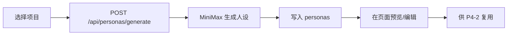

# P4-1 人设

> P4-1 负责为项目生成和维护一组可持续复用的 Reddit 人设。

## 页面能力

`/workflow/persona`

- 选择项目
- AI 批量生成人设
- 预览 persona 的说话方式
- 编辑、删除已有 persona
- 手动创建自定义 persona

## 当前实现

人设存储在 `personas` 表，不是旧文档里的固定 3 个系统模板。

常见字段包括：

- `name`
- `username`
- `avatar_emoji`
- `avatar_color`
- `description`
- `background`
- `tone`
- `focus`
- `writing_style`
- `reddit_habits`
- `writing_traits`
- `brand_strategy`
- `flaws`
- `sample_comments`

## 实际流程

## 相关接口

| 接口 | 作用 |
|------|------|
| `GET /api/personas?project_id=...` | 获取项目人设 |
| `POST /api/personas/generate` | AI 生成人设 |
| `POST /api/personas/[id]/preview` | 生成人设预览文案 |
| `PUT /api/personas/[id]` | 更新人设 |
| `DELETE /api/personas/[id]` | 删除人设 |

## 与旧文档的差异

- 不是固定的 `SportyRunner / AudioGeek / CommuterLife` 三模板。
- 不是多平台 persona 系统，当前实现核心平台就是 Reddit。
- 重点从“展示默认模板”改为“项目级 AI 生成人设库”。

## 下一步

[P4-2 创作](p4-content.md)
