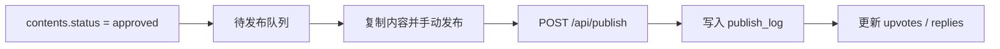

# P5 发布

> P5 管理待发布内容、发布登记和简单互动追踪。当前阶段仍是半自动发布。

## 页面能力

`/workflow/publish`

- 选择项目
- 查看待发布内容
- 一键复制内容到剪贴板
- 手动填写发布链接并登记为已发布
- 更新发布后的 upvotes / replies
- 删除发布记录并回退到待发布状态

## 当前发布方式

当前实现没有直接调用 Reddit 发布 API，实际流程是：

1. 在页面中选择待发布内容
2. 复制文案
3. 手动到 Reddit 发布
4. 回到系统登记 `published_url`
5. 后续手动维护互动数据

## 实际流程

## 相关接口

| 接口 | 作用 |
|------|------|
| `GET /api/publish?project_id=...` | 获取待发布与已发布列表 |
| `POST /api/publish` | 标记内容已发布 |
| `PUT /api/publish/[id]` | 更新互动数据 |
| `DELETE /api/publish/[id]` | 删除发布记录并回退内容状态 |

## 当前数据结构

发布数据写入 `publish_log`，核心字段包括：

- `content_id`
- `published_url`
- `upvotes`
- `replies`
- `status`
- `published_at`
- `last_tracked_at`

## 与旧文档的差异

- 当前没有多平台自动发布。
- 当前没有品牌提及分析报表页。
- 当前没有完整定时自动流水线；`run-pipeline` 还是示例接口。

## 后续查看

- [工作流总览](overview.md)
- [README](/Users/tianzhipeng/Documents/private/cnm/vt/reddit-ops-web/README.md)
