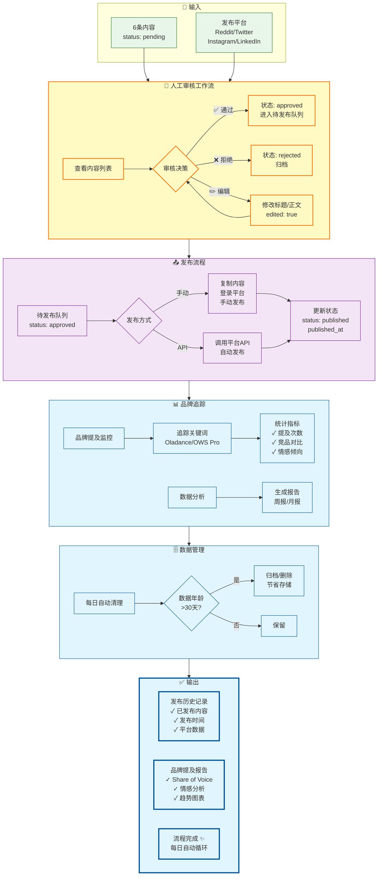
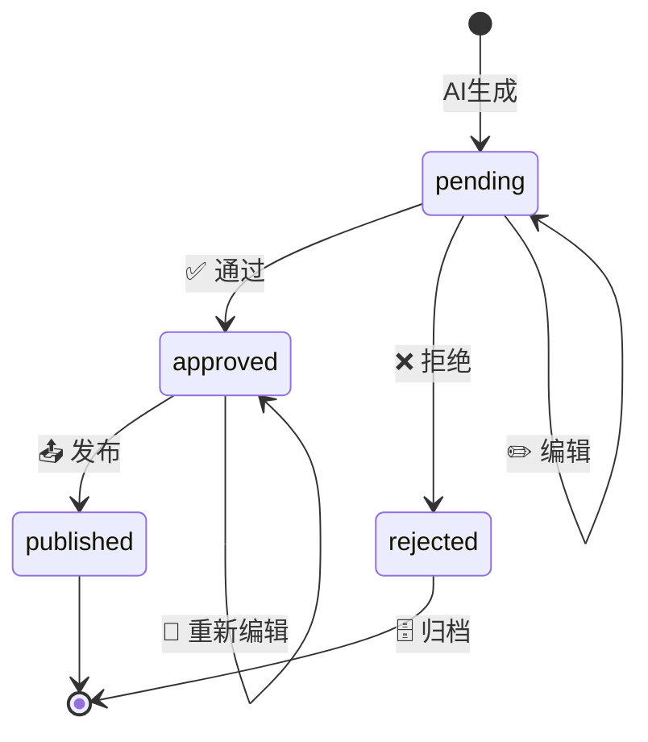
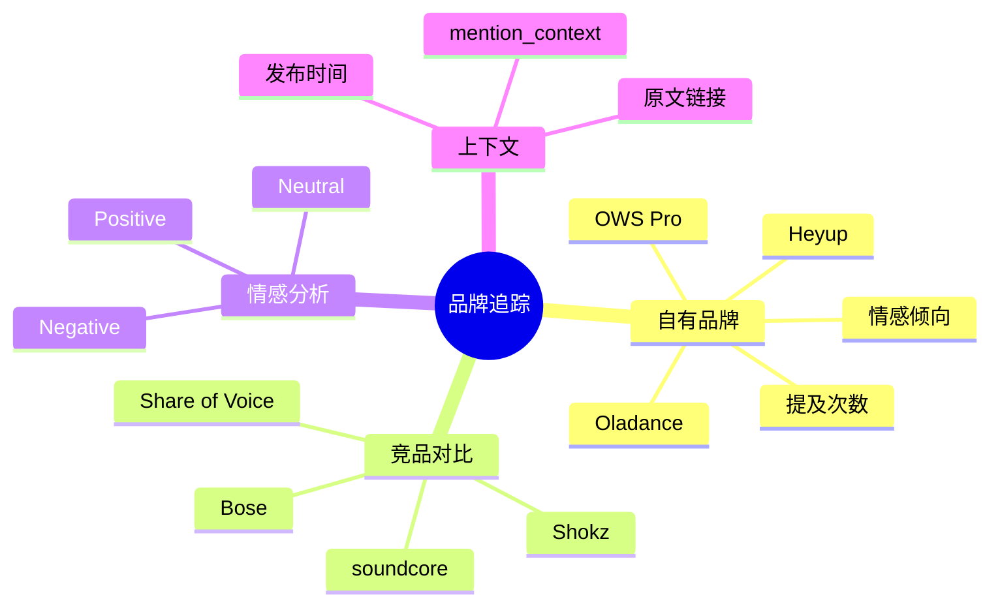
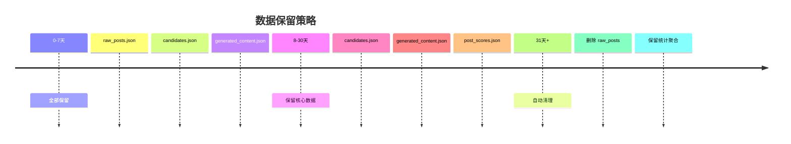
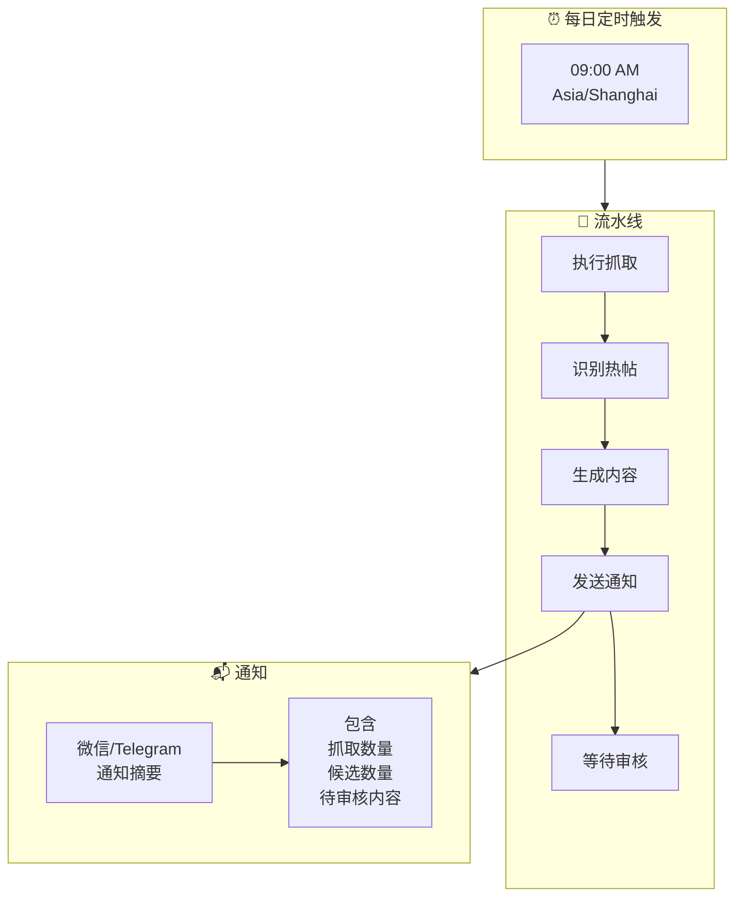

# P5 - 发布追踪

> 内容审核、发布执行、品牌提及追踪的完整闭环管理。

---

## 🎯 流程概览



---

## 👤 审核工作流

### 状态机



### 审核决策说明

| 决策 | 状态 | 说明 |
|------|------|------|
| ✅ 通过 | approved | 内容质量合格，进入待发布 |
| ❌ 拒绝 | rejected | 不合格，直接归档 |
| ✏️ 编辑 | pending | 需要修改，保存后重新审核 |

---

## 📤 发布管理

### 发布方式对比

| 方式 | 适用场景 | 优点 | 缺点 |
|------|----------|------|------|
| **手动** | 所有平台 | 完全可控 | 耗时 |
| **API** | Twitter/LinkedIn | 自动高效 | 需要平台授权 |

### 发布配置

```json
{
  "publishing": {
    "manual": {
      "instructions": "复制内容，登录对应平台发布"
    },
    "api": {
      "twitter": {
        "enabled": true,
        "auto_schedule": true
      },
      "linkedin": {
        "enabled": true,
        "auto_schedule": false
      }
    }
  }
}
```

---

## 📊 品牌追踪

### 追踪维度



### 追踪数据示例

```json
{
  "brand_mentions": [
    {
      "brand_name": "Oladance",
      "post_title": "Just tried OWS Pro...",
      "subreddit": "r/headphones",
      "sentiment": "positive",
      "mention_context": "...Oladance OWS Pro delivers surprisingly rich bass...",
      "scraped_at": "2024-03-01T09:00:00Z"
    }
  ]
}
```

### 情感分析规则

| 情感 | 关键词示例 | 说明 |
|------|------------|------|
| **Positive** | amazing, love, great, best | 正面评价 |
| **Negative** | hate, terrible, awful, disappointing | 负面评价 |
| **Neutral** | mentioned, compared, listed | 中性提及 |

---

## 🗄️ 数据管理

### 保留策略



### 清理规则

| 数据类型 | 保留天数 | 说明 |
|----------|----------|------|
| 原始帖子 | 7天 | raw_posts.json |
| 候选热帖 | 30天 | candidates.json |
| 生成内容 | 30天 | generated_content.json |
| 发布历史 | 永久 | publish_log.json |
| 品牌追踪 | 永久 | brand_mentions.json |

---

## 🔄 每日自动化循环



---

## 💡 设计亮点

| 亮点 | 说明 |
|------|------|
| **人工把关** | AI生成 + 人工审核，确保内容质量 |
| **灵活发布** | 支持手动和API自动发布 |
| **品牌追踪** | 自有品牌 + 竞品对比，持续监控 |
| **数据清理** | 自动清理过期数据，节省存储 |

---

## 🔗 相关文档

- [L1 总览](overview.md)
- [P4-2 - 内容创作](p4-content.md)
- [系统架构](../architecture/system-design.md)
